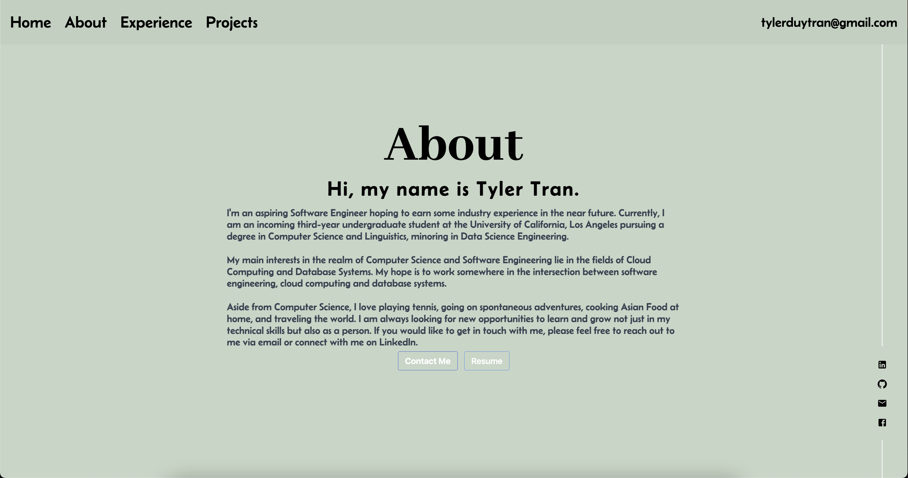

# Tyler Tran's Portfolio Website

Welcome to my portfolio website! This website showcases my work and serves as a platform to share my journey as a Software Engineer. 

 

## Background

This project began nearly 3 years ago when I first started building websites using HTML, CSS, and a bit of JavaScript. At that time, I had limited knowledge of JavaScript and felt overwhelmed by the possibilities and the time it would take to create a portfolio website using the traditional tech stack.

Initially, I explored different website templates on GitHub and came across the work of Codegrid, a "small YouTuber" who created stunning website designs. I thought it would be easy to create my own websites by leveraging some of the code I found. However, as I delved deeper into the project, I realized the complexity and limitations of my approach.

Back then, I hesitated to venture into frameworks like React or invest time in learning a front-end framework. Looking back, I realize that if I had embraced React earlier, it would have significantly reduced the development time of my portfolio website. However, I now understand that I simply wasn't ready and lacked the necessary maturity and ambition.

Fast forward to the present, as a college student completing my second year, I felt ready to take on the challenge of building my portfolio website. Surprisingly, I completed the project in just 5 days, a fraction of the estimated 2 weeks. This experience taught me the importance of enjoying the creative process and how it enhances productivity.

## Future Plans

While I'm satisfied with the current version of my portfolio website, I plan to continuously improve and refine it. In the future, I intend to add additional features and fine-tune the details to enhance the user experience. This project is a testament to my growth as a developer, and I look forward to expanding and evolving it further. Also looking to add a photo of myself on the About page. 

## Running the Website Locally

To run the website locally, follow these steps:

1. Clone the project to your local machine.
```bash
git clone https://github.com/tylerdtran/tylertran.me.git
```
2. Navigate to the project directory.
```bash
cd tylertran.me
```
3. Run the following command to install dependencies:

```bash
npm install
```

4. After the installation is complete, run the following command to start the website:

```bash
npm start
```

Enjoy exploring my portfolio website, and thank you for visiting!

---
